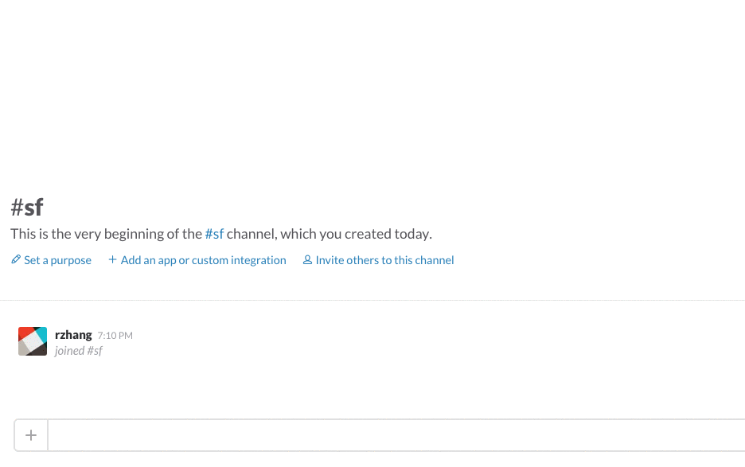

# Slack Text Meme

_A Slackbot that creates a meme with text_.

This Slackbot creates a meme with text overlay using [memegen](http://memegen.link).

## Installation

Clone this repo and then install dependencies:

    git clone https://github.com/ritazh/slack-textmeme.git
    cd slack-textmeme
    npm i

Setup the server (using Deis):

    deis create slacktextmemebot
    git push deis master

Or you can also push the app to Azure web service

Setup Slack slash command:

* Go to `http://[your-slack-org].slack.com/apps/manage/custom-integrations` 
* Add a slash command
* Fill in the following fields:
  * _Command_: the name of your slash command (example: `/textmeme`)
  * _URL_: The URL to request when the slash command is run (example: `https://slacktextmemebot.[your  host]/meme`)
  * _Method_: POST

## Usage

In Slack, send slash commands to /textmeme:

    /textmeme doge; This BOT is; AWESOME;
    /textmeme memes;

## License
Licensed using the MIT License (MIT); Copyright (c) Microsoft Corporation. For more information, please see [LICENSE](LICENSE).
