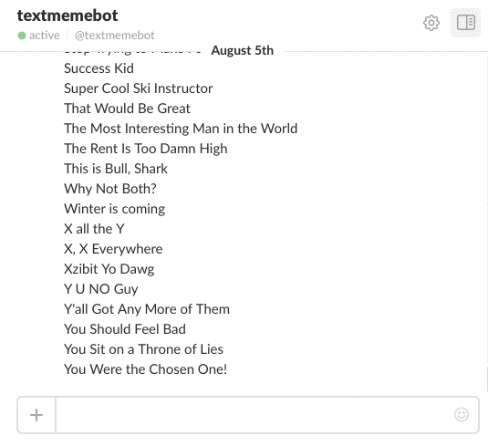

# Text Meme Bot with Microsoft Bot Framework

_A bot that creates a meme with text_.

This bot creates a meme with text overlay using [memegen](http://memegen.link).

## Installation

Clone this repo and then install dependencies:

    git clone https://github.com/MicrosoftDX/DecodedEpisode3.git
    cd DecodedEpisode3
    git checkout botframeworkdeis
    npm install

Push directly to Azure Web App:
     The [botframework branch](https://github.com/MicrosoftDX/DecodedEpisode3/tree/botframework) has been setup to synch directly to Azure web app
    
Setup the server (using Deis):

    deis create
    git push deis botframeworkdeis

> NOTE: The botframeworkdeis branch has been setup to enable Travis CI to build and push docker image to docker hub, then pull the image to Deis.

Setup bot in Slack:
* Follow the instructions on [Bot Framework website](https://dev.botframework.com/bots) to setup a Slack Channel.

## Usage

In Slack, after adding the textmeme bot user to a channel, you can start with:

    memes
    doge; This BOT is; AWESOME;

## License
Licensed using the MIT License (MIT); Copyright (c) Microsoft Corporation. For more information, please see [LICENSE](LICENSE).
